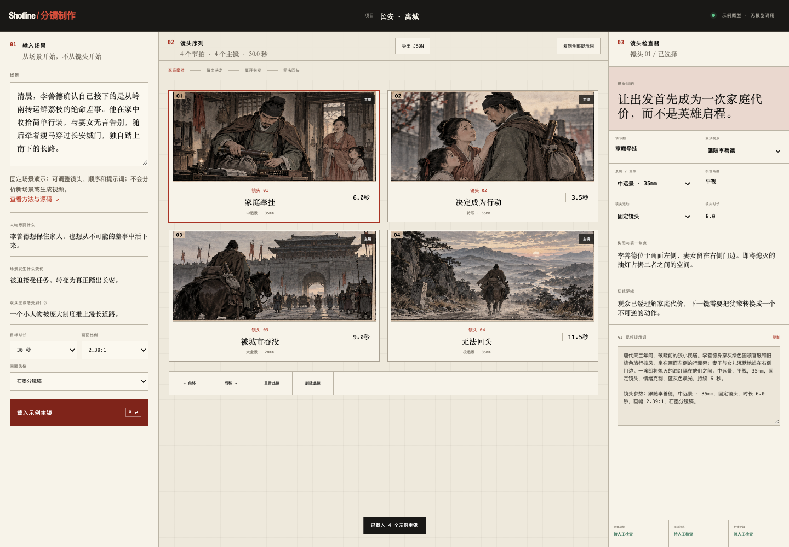

# Shotline 分镜制作

**让每个镜头都有叙事理由。** 从故事节拍，到镜头目的、观众视点、切镜逻辑，再到可编辑的 AI 视频提示词。

[在线体验 →](https://libuyi543-lang.github.io/Shotline/) · [5 分钟上手](docs/quickstart.md) · [中文完整示例](examples/changan-shot-breakdown.md) · [English](README.en.md)



> 当前版本：可复用的故事/分镜方法库 + 固定示例驱动的交互原型。无需注册或 API Key。原型不调用模型，也不生成视频。

## 为什么做 Shotline

“远景、特写、慢推”可以描述画面，却没有回答：这一镜让观众理解了什么？为什么此时切镜？Shotline 把这些创作判断写成可复用的工作流、提示词和检查表，让创作者在生成素材前先检查叙事。

| 输入 | 工作方式 | 产出 |
| --- | --- | --- |
| 一个故事想法 | 中心问题、人物诉求、事件/情感/价值三层检查 | 故事梗概、节拍表、场景表 |
| 一段完整场景 | 主镜、观众视点、空间关系、切镜理由 | 结构化分镜表 |
| 一版镜头草案 | 对照目的、轴线、构图、节奏检查表 | 具体修改理由与提示词 |

## 先试一次，再读方法

1. 打开[交互演示](https://libuyi543-lang.github.io/Shotline/)，查看“长安 · 离城”的 4 个示例主镜。
2. 选择镜头，修改景别、运动或时长；观察提示词参数变化。
3. 前移/后移镜头，编辑提示词，复制或导出 JSON。
4. 用[分镜检查表](storyboard/checklist.md)人工检查；刷新会清空编辑，请先导出。

有自己的场景？将 [分镜提示词模板](prompts/storyboard-template.md)、[工作流](storyboard/workflow.md)与场景一起交给你使用的 AI 助手。界面目前只演示固定案例，不分析新场景。

```bash
git clone https://github.com/libuyi543-lang/Shotline.git
cd Shotline
python3 -m http.server 4317 --bind 127.0.0.1 --directory demo
# 打开 http://127.0.0.1:4317
```

## 方法与源码

| 想完成的任务 | 入口 |
| --- | --- |
| 从想法写成故事 | [故事工作流](story-writing/workflow.md) · [故事提示词](prompts/story-writing-template.md) |
| 从场景拆出镜头 | [分镜工作流](storyboard/workflow.md) · [分镜示例](examples/storyboard-shot-list-example.md) |
| 检查一场戏或对白 | [场景与对白](story-writing/scene-and-dialogue.md) · [故事检查表](story-writing/checklist.md) |
| 接入现有 AI 助手 | [ChatGPT](adapters/chatgpt/README.md) · [Claude](adapters/claude/README.md) · [Codex](adapters/codex/README.md) |
| 查看实现与边界 | [原型源码](demo/) · [设计与验证说明](docs/project-notes.md) |

## 已完成与下一步

已完成：方法文档、Prompt 模板、检查表、故事与分镜案例、可编辑交互原型、JSON 导出。

计划：接入真实模型、任意场景输入、保存与导入项目、可验证的质量评测。自动质检与视频生成尚未实现。

如果这个方法帮到了你，欢迎 Star 方便再次找到。更有价值的反馈是：提交一段短场景，说明“哪一镜、为什么不成立、你期待怎样修改”。[提交使用反馈](https://github.com/libuyi543-lang/Shotline/issues/new/choose) · [贡献指南](CONTRIBUTING.md)

## License 与素材

项目代码和原创方法文档沿用 [MIT](LICENSE)。方法来自课程学习后的整理，课程映射见两个目录中的 `course-map.md`，不分发教材原文。演示插图为预制示意资产，案例以《长安的荔枝》人物设定作学习演示，不代表与原作有合作或授权关系；第三方名称与故事元素不因本仓库许可而转授权。
