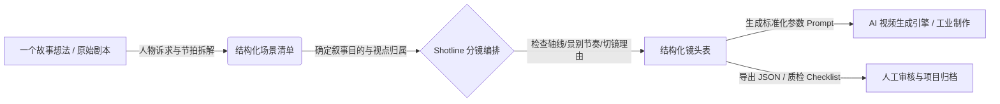

# Shotline 分镜制作

> **“让每一个分镜，都有不可替代的叙事理由。”**  
> 面向影视创作与 AI 视频生产的结构化工作流：从剧本节拍、镜头叙事目的、视点与切镜逻辑，到工业级 AI 视频 Prompt 工程体系。

[🎬 在线交互体验工作台](https://libuyi543-lang.github.io/Shotline/) · [⚡ 5 分钟上手实操](docs/quickstart.md) · [📖 中文场景分镜全案拆解](examples/changan-shot-breakdown.md) · [English README](README.en.md)

[](LICENSE)
[](https://libuyi543-lang.github.io/Shotline/)
[](prompts/)


> 💡 **项目定位与状态**：当前版本为**结构化故事/分镜工业级方法库 + 浏览器交互工作台原型**。无需注册、无需 API Key，即开即用。前端原型专注于**分镜序列组织、提示词参数联动与结构化 JSON 导出**，不直接消耗视频生成额度，帮助创作者在点击“生成”前先夯实叙事骨架。

---

## 🧐 为什么做 Shotline（解决什么痛点）

在当前 AI 视频生成流程中，很多创作者陷入了“随机抽卡”与“画面华丽但剧情断裂”的困境：
- **画面有了，但没有镜头目的**：“远景、特写、慢推”描述了表象，却说不清这个镜头让观众理解了什么关键信息。
- **切镜生硬，空间轴线崩塌**：上一秒人物在左，下一秒突然视线跳轴；画面单看很美，剪在一起完全无法连贯。
- **提示词混乱，难以工程化复现**：无法将影视导演的机位调度、情绪节拍与光影参数固化为跨模型可调用的标准 Prompt。

**Shotline 的解决逻辑：将视听语言工程化、参数化。**



---

## 📦 核心交付内容与知识工程地图

| 模块 | 核心解决问题 | 核心入口与资产 |
| :--- | :--- | :--- |
| **01 故事与戏剧节拍** | 解决剧本逻辑散乱：从中心问题、人物欲望到三幕节拍与场景对白设计。 | [故事工作流](story-writing/workflow.md)<br>[戏剧节拍 Checklist](story-writing/checklist.md) |
| **02 分镜视听语言框架** | 规范机位、景别、构图、运动调度与视点分配，杜绝无意义切镜。 | [分镜工作流](storyboard/workflow.md)<br>[分镜检查清单](storyboard/checklist.md) |
| **03 跨模型 Prompt 协议** | 将影视参数提炼为可直接赋能 Claude/ChatGPT/Midjourney/Runway 的提示词模板。 | [分镜 Prompt 模板](prompts/storyboard-template.md)<br>[故事 Prompt 模板](prompts/story-writing-template.md) |
| **04 真实工业拆解案例** | 以《长安的荔枝》风格场景为例，提供端到端 4 幕主镜与全流程镜头拆解。 | [中文完整拆解案](examples/changan-shot-breakdown.md)<br>[结构化分镜示例](examples/storyboard-shot-list-example.md) |
| **05 轻量交互工作台** | 纯前端实现的镜头编排看板，支持动态调整参数、镜头拖拽重排与 JSON 导出。 | [在线工作台](https://libuyi543-lang.github.io/Shotline/)<br>[原型源码](demo/) |

---

## ⚡ 2 分钟极速上手

### 方式 1：无需配置，直接在线玩
直接访问 [Shotline 在线演示](https://libuyi543-lang.github.io/Shotline/)：
1. 观察预置的 4 个主镜头（建立镜头、反应镜头、特写镜头、转场镜头）。
2. 在右侧面板修改景别、机位角度或镜头运动，观察下方 AI 提示词与 JSON 的动态响应。
3. 调整镜头顺序，一键导出为通用 JSON。

### 方式 2：本地启动交互看板
```bash
git clone https://github.com/libuyi543-lang/Shotline.git
cd Shotline
python3 -m http.server 4317 --bind 127.0.0.1 --directory demo
# 打开浏览器访问 http://127.0.0.1:4317
```

### 方式 3：结合你常用的大模型（ChatGPT / Claude / Cursor）
将 [`prompts/storyboard-template.md`](prompts/storyboard-template.md) 直接粘贴至你的 AI 对话框中，输入你的一句话场景设定，即可按照 Shotline 工业级标准批量输出结构化分镜。

---

## 🛣️ 发展路线（Roadmap）

- [x] **开源原创视听语言方法论与 Prompt 体系**
- [x] **上线纯前端零门槛分镜交互工作台**
- [x] **支持分镜脚本标准化 JSON 导出**
- [ ] 接入主流大模型 API，支持自由输入剧本自动生成分镜卡片
- [ ] 结合本地 ComfyUI / Runway / 可灵 API 实现一键拉流出图
- [ ] 自动化镜头轴线冲突与信息重复性 AI 质检器

---

## 🤝 贡献与交流

- 欢迎影视从业者、AI 视频创作者、独立导演 Star 收藏备用！
- 如果你在创作中发现某个镜头设计不合理、或有更好的 Prompt 封装方案，欢迎[提交 Issue / 案例](https://github.com/libuyi543-lang/Shotline/issues/new/choose)。
- 详细规范请查看 [CONTRIBUTING.md](CONTRIBUTING.md)。

## 📄 License 与免责说明

本项目遵循 [MIT License](LICENSE)。方法论基于公开视听语言理论整理，演示项目所涉参考案例仅供教学与非商业交流，所生成内容与相关第三方原作无关。
